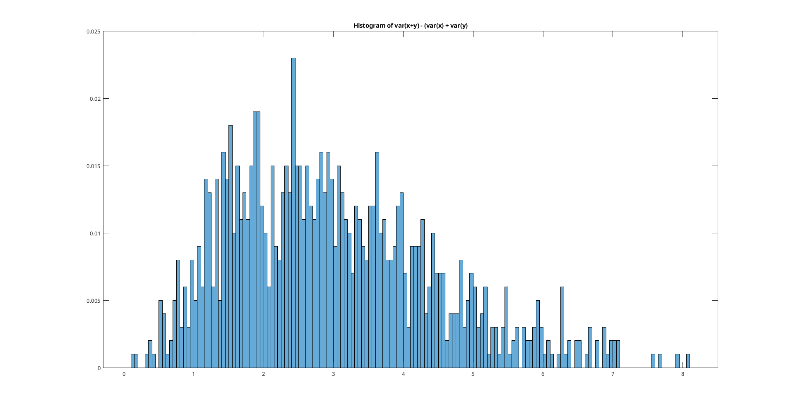
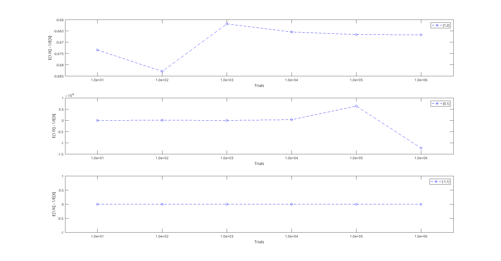

# Chapter 2
## 1. Coin flip empirical probability validation

## 2. Distribution of random numbers (exponential) generated by uniform distribution

## 3. Validate var(x+y) != var(x) + var(y) for dependent random variables x,y

## 4. Validate E[1/x] != 1/E[x] for X~U(0,1),U(1,2),U(-1,1)
